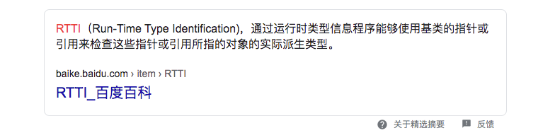

Thinking in Java和On Java 8读书笔记（只记录了对我来说的重点）

[On Java 8](https://lingcoder.github.io/OnJava8/#/)

## 第一章 对象导论

### 1.1 抽象过程

所有编程语言都提供抽象机制。

OOP允许根据问题来描述问题，而不是根据运行解决方案的计算机来描述问题。但是它仍然与计算机有联系：每个对象看起来都有点像一台微型计算机—它具有状态，还具有操作，用户可以要求对象执行这些操作。

### 1.2 每个对象都有一个接口

所有的对象都是唯一的，但同时也是具有相同的特性和行为的对象所归属的类的一部分。

### 1.3 每个对象都提供服务

当开发或理解一个程序设计时，最好的方法是将对象想象为“服务提供者”，程序本身向用户提供服务。我们的目标就是去创建（或使用已存在的）能够提供理想的服务来解决问题的一系列对象。

人们在设计面向对象时所面临的一个问题是，将过多的功能都塞在一个对象中。

在良好的面向对象设计中，每个对象都可以很好地完成一项任务，但是它并不试图做更多的事情。

### 1.4 被隐藏的具体实现 （封装）

如果所有的类成员对任何人都是可用的，那么客户端程序员（调用方）就可以对类做任何事情。将实现隐藏起来，创建者可以任意修改而不用担心对其他人造成影响。（对他人造成影响是说，随意修改属性值可能对他人的值产生影响。公开的属性将直接拿到真正的对象，而get拿到的是对象的副本，可变类除外）

### 1.5 复用具体实现

组合（Composition）继承被视为“has a”（拥有）关系。

在建立新类时，应该优先考虑组合，因为它更加简单灵活。

### 1.7 伴随多态的可互换对象

在OOP中，程序知道运行时才能够确定代码的地址。面向对象程序设计语言使用了后期绑定的概念。当向被调用的代码发出消息时，被调用的代码直到运行时才能确定。Java使用一小段特殊的代码来替代绝对地址调用。这段代码使用在对象中存储的信息来计算方法体的地址。这样，根据这一小段代码的内容， 每个对象都可以具有不同的行为表现。当向一个对象发送消息时，该对象就能够知道对这条消息做什么。

Java的动态绑定是默认行为。

### 1.8 单继承结构

单根继承结构使垃圾回收器的实现变得容易得多。由于所有的对象都保证具有其类型信息，因此不会因为无法确定对象的类型而陷入僵局。

### 1.10 对象的创建和生命周期

垃圾回收器“知道”对象何时不再被使用，并自动释放对象占用的内存。这一点同所有对象都是继承自单根基类Object以及**只能以一种方式创建对象（在堆上创建）**这两个特性结合起来

### 1.14 总结

通常按照 Java 规范编写的程序会比面向过程程序更容易被理解。

你看到的是对象的概念，这些概念是站在“问题空间”（问题本身）的（而不是站在计算机角度的“解决方案空间”），以及发送消息给对象以指示该空间中的活动。面向对象编程的一个优点是：设计良好的 Java 程序代码更容易被人阅读理解。由于 Java 类库的复用性，通常程序要写的代码也会少得多。

## 第二章 

#### 2.2.1 存储位置

对象引用存放于栈中，对象存在堆中

基本类型取决于全局变量还是局部变量，全局变量放置堆中，局部变量放置栈中

#### 练习2

```java
/**
 * * 2.
 * * Create a class with a String field initialized
 * * at the point of definition, and another one
 * * initialized by the constructor. What is the
 * * difference between the two approaches?
 * <p>
 * 调用构造器
 * 按照属性的声明顺序
 * str 在构造器初始化前初始化了
 * conStr 被初始化为null
 * 执行构造器的主体
 * conStr 被赋值
 * conStr 更加灵活，可以通过构造器传参设置
 */
class Demo2 {
    private String str = "initialized";
    private String conStr;

    public Demo2() {
        this.conStr = "init by con";
    }

}
```

### 5.4 this关键字

为了能用简便、面向对象的语法来编写代码—即“发送消息给对象”，编译器做了一些幕后工作。它暗自把“所操作对象的引用”作为第一个参数传递给了方法。

```java
class Banana {
    void peel(int i) {
        /*...*/
    }
}
public class BananaPeel {
    public static void main(String[] args) {
        Banana a = new Banana(), b = new Banana();
        a.peel(1);
        b.peel(2);
    }
}
```

因此，上述的方法调用像这个样子

```java
Banana.peel(a, 1)
Banana.peel(b, 2)
```

但是，对象引用是被秘密地传达给编译器——并不在参数列表中。

this关键字表示对“调用方法的那个对象”的引用，this对象只能在方法内部使用。

尽管可以使用this调用一个构造器，但却不能调用两个。必须将构造器调用写在构造方法的最上面，否则编译器会报错

除了构造方法外，编译器禁止在其他任何方法中调用构造器

### 5.5 清理：终结处理和垃圾回收

一旦垃圾回收器准备好释放对象占用的存储空间，将首先调用其finalize方法，并且在下一次垃圾回收动作发生时，才会真正回收对象占用的内存。

Java里的对象并非总是被垃圾回收：

1. 对象可能不被垃圾回收
2. 垃圾回收只和内存有关

如果程序执行结束，并且垃圾回收器一直都没有释放你创建的任何对象的存储空间，则随着程序的退出，那些资源也会全部交还给操作系统。

对于与垃圾回收有关的任何行为来说（尤其是finalize方法），它们也必须同内存及其回收有关

#### 5.5.3 终结条件

finalize可以用来做”对象终结条件“的验证，如果某次finalize的动作使得可能的缺陷被发现，那么就可以根据此找出问题的所在

```java
lass Book {
    boolean checkedOut = false;

    Book(boolean checkOut) {
        checkedOut = checkOut;
    }

    void checkIn() {
        checkedOut = false;
    }

    @Override
    protected void finalize() throws Throwable {
        if (checkedOut) {
            System.out.println("Error: checked out");
        }
        // Normally, you'll also do this:
        // super.finalize(); // Call the base-class version
    }
}

public class TerminationCondition {

    public static void main(String[] args) {
        Book novel = new Book(true);
        // Proper cleanup:
        novel.checkIn();
        // Drop the reference, forget to clean up:
        new Book(true);
        // Force garbage collection & finalization:
        System.gc();
        new Nap(1); // One second delay
    }

}
```

### 5.7 构造器初始化

无法阻止自动初始化的进行，它将在构造器被调用之前发生。变量定义的先后顺序决定了初始化的顺序。

#### 5.7.2 静态数据的初始化

无论创建多少个对象，静态数据都只占用一分存储区域。static关键字不能应用于局部变量，因此它只能作用于域。

## 第七章 复用类

#### 7.2.1 初始化基类

即使不为子类创建构造器，编译器也会为你合成一个默认的构造器，该构造器将调用父类的构造器

## 第九章 接口

### 9.7 接口中的域

接口中的域都是被static final修饰的

在接口中定义的域不能是”空final“（在使用时初始化），但是可以被非常量表达式初始化

## 第14章 类型信息



运行时类型信息（Run-Time Type Information）使得你可以在程序运行时发现和使用类型信息

### 14.2 Class对象

Class对象包含了与类有关的信息，Class对象就是用来创建所有的常规对象的

类是程序的一部分，每个类都有一个Class对象。为了生成这个类的对象，运行这个程序的Java虚拟机将使用被称为”类加载器“的子系统

所有的类都是在对其第一次使用时，动态加载到JVM中的。当程序创建第一个对类的静态成员的引用时，就会加载这个类。这证明构造器也是类的静态方法，即使在构造器之前并没有使用static关键字。因此，使用new操作符创建类的新对象也会被当做对类的静态成员的引用

Java程序的各个部分是在必须时才加载的

类加载器首先检查这个类的Class对象是否已经加载。如尚未加载，默认的类加载器就会根据类名查找.class文件

一旦某个类的Class对象被载入内存，它就被用来创建这个类的所有对象

`Class.forName(classPath);`

以上代码表示如果类没有被加载就去加载它

无论何时，只要你想在运行时适用类型信息，就必须现获取恰当的Class对象的引用

使用newInstance创建的类，必须带有默认的构造器（无参构造器）

#### 14.2.1 类字面常量

当使用.class来创建对Class对象的引用时，不会自动地初始化该Class对象。为了使用类而做的准备工作实际包含三个步骤：

1. 加载：由类加载器执行，查找字节码，并从字节码中创建一个Class对象
2. 链接：为静态域分配存储空间并初始化该内存空间
3. 初始化：如果该类具有超类，则对其初始化，执行静态初始化域和静态初始化块

static final（编译器常量），不需要对类进行初始化就可以被读取，但仅仅是static和final并不足以确保这种行为（不是编译器常量）

#### 14.2.2 泛化的Class引用

Class\<?>优于平凡的Class，它表示你就是选择了非具体的版本

当你将泛型语法用于Class对象时，newInstance将返回该对象的确切类型

### 14.5 instanceof 与 Class的等价性

```java
(x instanceof Base)
Base.class.isInstance(x)
x.getClass() == Base.class)
x.getClass().equals(Base.class))
```

instance和jsInstance()的生成结结果完全一样，==和equasl也是一样的

instanceof保持了类型的概念，它指的是”你是这个类吗，或者你是这个类的派生类吗？“，如果用==比较实际的Class对象，就没有考虑继承—它是否不是这个确切的类型

## 第十五章 泛型

### 15.4泛型方法

是否拥有泛型方法，与其所在的类是否是泛型没有关系

对于一个static方法而言，无法访问泛型类的类型参数，如果static方法需要使用泛型能力，就必须使其成为泛型方法

### 15.7 擦除

#### 15.7.3 擦除的问题

泛型不能用于显示地引用运行时类型的操作之中，例如转型、instanceof操作和new表达式。因为所有关于参数的类型信息都丢失了（擦除）

#### 15.7.4 边界处的动作

在泛型中所有的动作都发生在边界处（对象进入和离开方法的地点）—对传入的值进行额外的编译器检查，对传递出去的值进行转型（都由编译器处理）

### 15.8 擦除的补偿

擦除丢失了在泛型代码中执行某些操作的能力。任何在运行时需要知道确切类型信息的操作都讲无法工作

#### 15.8.1 创建类型的实例

创建一个new T()的尝试将无法实现，部分原始是因为擦除，另一部分原因是因为编译器不能验证T具有默认构造器

sun的伙计们建议使用显示的工厂来创建实例，还可以使用模板方法

#### 15.8.2 泛型数组

可以使用arraylist来创建数组

使用Array.newInstance来创建数组是一种较好的方式

### 15.9 边界

边界使得你可以在用于泛型的参数类型上设置限制条件，更重要的效果是你可以按照自己的边界类型来调用方法

通配符被限制为单一边界

### 15.10 通配符

泛型的主要作用是将一些错误检查移入到编译期

无界限通配符 ?

? 表示不确定的类型，和Object的区别是，Object表示任意类型皆可以

? 虽然是不确定的，但是它指代的一定是一个具体的类型，他一定是单一的具体的。

比如 <? extends Fruit>虽然不确定是什么类型，但是我们知道它一定是Fruit下的某一个具体类型，可以是Orange也可以是Apple，但是具体是哪个我们不知道，我们也不关心。

比如List\<Object> list ，可以addstr 可以 addint 等等。但是List<?> list2就不可以，因为我们不确定具体是什么类型，不能保证安全性

## 第十九章 枚举类型

### 19.4 values()方法的神秘之处

values()是由编译器添加的static方法，由于values是编译器插入到enum定义中的static方法，所以，如果将enum实例向上转型为Enum，那么values方法就不可以访问了。在Class中有个getEnumConstants方法，即便Enum接口中没有values方法，我们也可以通过Class对象取得所有的enum实例

enum实例必须定义在任何方法或属性之前

### 19.5 实现，而非继承

所有的enum都继承自java.lang.Enum类，所以enum无法再继承其他类

enum可以实现一个或多个接口，每个实例都要重写接口的所有方法。必须要有一个实例才能调用接口的方法

### 19.7 使用接口组织枚举

在一个接口的内部，创建实现接口的枚举，一次将元素进行分组，可以达到将枚举元素分类组织的目的

对于enum而言，实现接口是使其子类化的唯一办法

### 19.8 EnumSet

```java
public class EnumSets {
    public static void main(String[] args) {
        EnumSet<AlarmPoints> points = EnumSet.noneOf(AlarmPoints.class); // Empty
        points.add(BATHROOM);   
        points.addAll(EnumSet.of(STAIR1, STAIR2, KITCHEN));
        points = EnumSet.allOf(AlarmPoints.class);
        points.removeAll(EnumSet.of(STAIR1, STAIR2, KITCHEN));
        points.removeAll(EnumSet.range(OFFICE1, OFFICE4));
        // 恢复
        points = EnumSet.complementOf(points);
    }
}
```

EnumSet（抽象类）有两个实现类，由enum实例的数量决定哪个子类（超过一个long值，64位）。

### 19.9 EnumMap

EnumMap是一种特殊的Map，它要求key必须是一个enum。由于enum本身的限制，所以EnumMap的内部可以由数组实现，所以EnumMap的速度很快

和EnumSet一样，enum实例定义的顺序决定了其在EnumMap的顺序（enum实例被它们添加的顺序不重要，输出顺序取决于实例定义的顺序）

在面向对象的程序设计中，不同的行为与不同的类关联。enum实例就像一个独特的类，实现接口方法时可以体现出多态的行为，但是，enum实例并不是真正的类。它与类的相似之处仅此而已

编译器不允许我们将一个enum实例当做class类型

----

此章讲了很多enum的实用技巧和设计模式，目前水平有限看的勉强。看完设计模式再回来读这些案例

## 第二十章 注解

注解的优点包括更加干净易读的代码以及编译期类型检查等

### 20.1 基本语法

#### 20.1.1 定义注解

与其他任何Java接口一样，注解也将会编译成class文件

#### 20.1.2 元注解

Java8 内置了5中标准注解，以及5种元注解。元注解用于注解其他的注解

| 注解        | 解释                                                         |
| ----------- | ------------------------------------------------------------ |
| @Target     | 表示注解可以用于哪些地方。可能的 **ElementType** 参数包括： **CONSTRUCTOR**：构造器的声明； **FIELD**：字段声明（包括 enum 实例）； **LOCAL_VARIABLE**：局部变量声明； **METHOD**：方法声明； **PACKAGE**：包声明； **PARAMETER**：参数声明； **TYPE**：类、接口（包括注解类型）或者 enum 声明。 |
| @Retention  | 表示注解信息保存的时长。可选的 **RetentionPolicy** 参数包括： **SOURCE**：注解将被编译器丢弃； **CLASS**：注解在 class 文件中可用，但是会被 VM 丢弃； **RUNTIME**：VM 将在运行期也保留注解，因此可以通过反射机制读取注解的信息。 |
| @Documented | 将此注解保存在 Javadoc 中                                    |
| @Inherited  | 允许子类继承父类的注解                                       |
| @Repeatable | 允许一个注解可以被使用一次或者多次（Java 8）。               |

大多数时候，程序员定义自己的注解，并编写自己的处理器来处理他们。

以下是5中内置注解：

- **@Override**：表示当前的方法定义将覆盖基类的方法。如果你不小心拼写错误，或者方法签名被错误拼写的时候，编译器就会发出错误提示。
- **@Deprecated**：如果使用该注解的元素被调用，编译器就会发出警告信息。
- **@SuppressWarnings**：关闭不当的编译器警告信息。
- **@SafeVarargs**：在 Java 7 中加入用于禁止对具有泛型varargs参数的方法或构造函数的调用方发出警告。
- **@FunctionalInterface**：Java 8 中加入用于表示类型声明为函数式接口。

### 20.2 编写注解处理器

#### 20.2.1 注解元素

注解元素可用的类型如下所示：

- 所有基本类型
- String
- Class
- enum
- Annotation
- 以上类型的数组

#### 20.2.2 默认值限制

元素不能有不确定的值，元素必须要么具有默认值，要么在使用注解时提供元素的值。任何时候都不能用null作为元素的值

#### 20.2.4 注解不支持继承

不能使用extends来继承某个@interface

### 20.5 基于注解的单元测试

要生成一个非嵌入式的测试，最简单办法就是使用继承，或者还可以使用组合的方式创建非嵌入式的测试

```java

public class AUExternalTest extends AtUnitExample1 {
    @Test
    boolean methodOne() {
        return methodOne().equals("This is methodOne");
    }
    @Test
    boolean methodTwo() {
        return methodTwo() == 2;
    }
}
```


---

第十六章和十七章数组、容器等数据结构再看

第18章I/O等看Java网络编程时一起看 或之后看

第21章并发等看Java并发编程之美前再看


## OnJava8 十三章 函数式编程

面向对象编程是对数据进行抽象，函数式编程是对行为进行抽象

函数式语言背后有很多动机，它通常取决于各种观点：为“并行编程”，“代码可靠性”和“代码创建和库复用”。其核心是：在思考问题时，使用不可变值和函数，函数对一个值进行处理，映射成另一个值

不可变对象和无副作用”范式解决了并发编程中最基本和最棘手的问题之一， 因此，经常提出纯函数式语言作为并行编程的解决方案（还有其他可行的解决方案）

### 方法引用

方法签名：方法名+参数列表，和返回值无关

只需要引入和接口中具有相同参数的方法即可(接口若是void，其他方法的返回值无关精要，接口若是规定了返回值其与方法必须一致)

### 构造函数

对于多个构造函数的引用都可以使用类型::new 这样的方式调用，编译器可以从中知道具体使用哪个构造函数

### 函数式接口

 编译器会在后台把方法引用或 Lambda 表达式包装进实现目标接口的类的实例中

Java 8 允许我们将函数赋值给接口

如果你了解命名模式，顾名思义就能知道特定接口的作用。

以下是基本命名准则：

1. 如果只处理对象而非基本类型，名称则为 `Function`，`Consumer`，`Predicate` 等。参数类型通过泛型添加。
2. 如果接收的参数是基本类型，则由名称的第一部分表示，如 `LongConsumer`，`DoubleFunction`，`IntPredicate` 等，但返回基本类型的 `Supplier` 接口例外。
3. 如果返回值为基本类型，则用 `To` 表示，如 `ToLongFunction <T>` 和 `IntToLongFunction`。
4. 如果返回值类型与参数类型相同，则是一个 `Operator` ：单个参数使用 `UnaryOperator`，两个参数使用 `BinaryOperator`。
5. 如果接收参数并返回一个布尔值，则是一个 **谓词** (`Predicate`)。
6. 如果接收的两个参数类型不同，则名称中有一个 `Bi`。

用基本类型（`IntToDoubleFunction`）的唯一理由是可以避免传递参数和返回结果过程中的自动拆装箱，进而提升性能

### 闭包

被 Lambda 表达式引用的局部变量必须是 `final` 或者是等同 `final` 效果的。

Lambda 可以没有限制地引用 实例变量和静态变量。但 局部变量必须显式声明为final，或事实上是final 

实际上只要有内部类，就会有闭包（Java 8 只是简化了闭包操作）。在 Java 8 中，内部类的规则放宽，包括**等同 final 效果**(8之前内部类的局部变量必须声明为final)。Lambda不是内部类

### 柯里化

 柯里化意为：将一个多参数的函数，转换为一系列单参数函数

```java
public class CurryingAndPartials {
   // 未柯里化:
   static String uncurried(String a, String b) {
      return a + b;
   }
   public static void main(String[] args) {
      // 柯里化的函数:
      Function<String, Function<String, String>> sum =
         a -> b -> a + b; // [1]

      System.out.println(uncurried("Hi ", "Ho"));

      Function<String, String>
        hi = sum.apply("Hi "); // [2]
      System.out.println(hi.apply("Ho"));

      // 部分应用:
      Function<String, String> sumHi =
        sum.apply("Hup ");
      System.out.println(sumHi.apply("Ho"));
      System.out.println(sumHi.apply("Hey"));
   }
}
```

## OnJava8 十四章 流式编程

> 集合优化了对象的存储，而流（Streams）则是关于一组组对象的处理

流使得程序员站在更高的抽象层次上对集合进行操作

显示地编写迭代过程的方式成为外部迭代，而流式编程的一个核心特征就是内部迭代（你看不到任何迭代过程）

流是懒加载的。这代表着它只在绝对必要时才计算。你可以将流看作“延迟列表”。由于计算延迟，流使我们能够表示非常大（甚至无限）的序列，而不需要考虑内存问题

### 流支持

只描述stream，不产生新集合的方法叫做惰性求值方法，会从stream产生值得方法叫做及早求值方法

如果返回值是stram便是惰性求值，如果返回值是另外的值或是空便是及早求值

使用这些操作的理想方式就是形成一个惰性求值的链，最后用一个及早求值的操作返回想要的结果

在接口中添加被 default（默认）修饰的方法。通过这种方案，设计者们可以将流式（stream）方法平滑地嵌入到现有类中。流方法预置的操作几乎已满足了我们平常所有的需求。流操作的类型有三种：

- 创建流
- 修改流元素（中间操作， Intermediate Operations）
- 消费流元素（终端操作， Terminal Operations）

最后一种类型通常意味着收集流元素（通常是汇入一个集合）

### 流创建

通过 Stream.of() 很容易地将一组元素转化成为流

除此之外，每个集合都可以通过调用 stream() 方法来产生一个流

Stream.generate() 的用法，它可以把任意 Supplier\<T> 用于生成 T 类型的流。

### 中间操作

1. 跟踪和调试：peek
2. 流元素排序：sorted
3. 移除元素：distinct去重，filter过滤
4. 将函数应用到元素上：map、mapToInt…，将元素经过一系列操作后，将操作后的流返回
5. 在map中组合流：flatmap可以使多个流转为一个

### 终端操作

可以说终端操作总是我们在流管道中所做的最后一件事，它可以获取流的最终结果

1. 数组：toArray
2. 循环：forEach、forEachOrdered
3. 集合：collect
4. 组合
5. 匹配
6. 查找
7. 信息